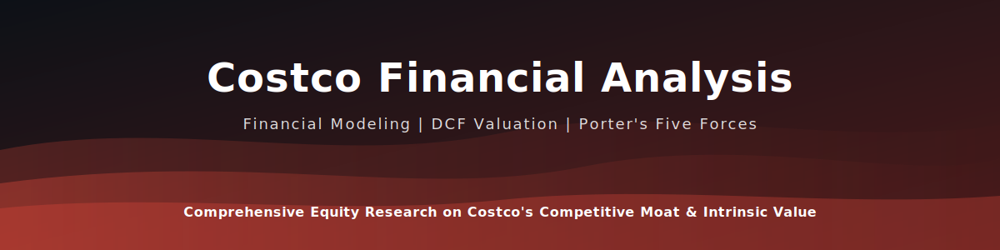
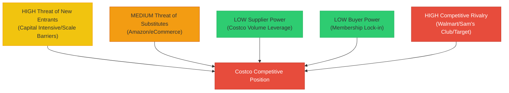

[](https://github.com/khushi2704rj-sephora/costco-financial-analysis-/actions/workflows/link-check.yml)

<div align="center">



</div>


<div align="center">

# 🛒 Costco Wholesale Corporation (COST): Financial & Strategic Analysis

[]()
[]()
[]()
[]()
[](LICENSE)

**A comprehensive equity research report evaluating Costco's competitive advantage, financial health, and intrinsic value.**

[📄 **Read the Full Financial Analysis**](reports/Costco%20Financial%20Analysis.docx) · [📊 **View Presentation**](presentation/Costco%20Financial%20PPT.pdf)

---

[🎯 Summary](#-executive-summary) · [🏗️ Strategy](#️-strategic-framework) · [📊 Financials](#-financial-highlights) · [📂 Structure](#-repository-structure) · [🤝 Contributing](#-contributing)

</div>

---

## 🎯 Executive Summary

> **Recommendation: BUY** (Based on strong membership retention and pricing power)

Costco Wholesale Corp. (NASDAQ: COST) operates a membership-only warehouse club model that generates consistent cash flows through recurring membership fees. This analysis explores how its low-margin, high-volume strategy creates a virtuous cycle of customer loyalty and operational efficiency.

**Key Drivers:**
- **Membership Moat:** ~90% renewal rates provide predictable high-margin revenue.
- **Supply Chain Efficiency:** Limited SKU count (~4,000 vs. 30,000 at competitors) increases inventory turnover.
- **Private Label Strength:** Kirkland Signature drives margin expansion and brand loyalty.

---

## 🏗️ Strategic Framework

### Porter's Five Forces Analysis



### SWOT Analysis

| **Strengths** | **Weaknesses** |
| :--- | :--- |
| 🟢 **Membership Model:** Recurring fee income buffers low margins.<br>🟢 **Brand Loyalty:** Kirkland Signature is a trusted powerhouse.<br>🟢 **Employee Retention:** Industry-leading wages reduce turnover costs. | 🔴 **eCommerce Lag:** Digital presence trails Amazon/Walmart.<br>🔴 **Limited SKU Selection:** May deter convenient one-stop shopping.<br>🔴 **Aging Demographic:** Need to attract Gen Z shoppers. |

| **Opportunities** | **Threats** |
| :--- | :--- |
| 🟡 **International Expansion:** Huge runway in China & Europe.<br>🟡 **Digital Transformation:** Improving app/online experience.<br>🟡 **Services Growth:** Travel, Insurance, Pharmacy expansion. | 🟠 **Intense Competition:** Amazon Prime & Sam's Club.<br>🟠 **Supply Chain Disruption:** Global sourcing vulnerabilities.<br>🟠 **Cost Inflation:** Pressure on "price leader" promise. |

---

## 📊 Financial Highlights

### Key Metrics (FY2021–FY2025)

| Metric | FY2021 | FY2023 | FY2025E | Trend |
|---|---|---|---|---|
| **Revenue** | $192B | $237B | $270B | 📈 +41% |
| **Net Income** | $5.0B | $6.3B | $7.4B | 📈 +48% |
| **Membership Revenue** | $3.9B | $4.6B | $5.1B | 📈 +31% |
| **Renewal Rate** | 91% | 92.5% | 93% | ✅ Stable |
| **Inventory Turnover** | 12.5x | 11.8x | 12.2x | ✅ Industry-leading |
| **ROIC** | 22% | 25% | 27% | 📈 Strong |
| **P/E Ratio** | 40x | 48x | 55x | ⚠️ Premium valuation |

### Valuation Approach

The valuation model includes:
1.  **Discounted Cash Flow (DCF):** Projected free cash flows over 5 years.
2.  **Ratio Analysis:**
    -   **Inventory Turnover:** Significantly higher than peers due to SKU discipline.
    -   **ROIC (Return on Invested Capital):** Demonstrates efficient capital deployment.
3.  **Comparable Analysis (Comps):** Benchmarked against Walmart (WMT), Target (TGT), and BJ's (BJ).

### Peer Comparison

| Company | P/E | Inv. Turnover | Membership Model |
|---|---|---|---|
| **Costco (COST)** | 55x | 12.2x | ✅ Yes |
| Walmart (WMT) | 32x | 8.5x | ❌ No |
| Target (TGT) | 18x | 6.1x | ❌ No |
| BJ's (BJ) | 22x | 10.1x | ✅ Yes |

---

## 📂 Repository Structure

```
costco-financial-analysis/
│
├── reports/
│   ├── Costco Financial Analysis.docx     ← 📘 Full Equity Research Report
│   └── Costco Case Reflective Report.docx ← 📝 Strategy & Ops Case Study
│
├── presentation/
│   └── Costco Financial PPT.pdf           ← 📊 Investor Pitch Deck
│

├── LICENSE                                ← MIT License
└── README.md                              ← Project documentation
```

---

## 🤝 Contributing

This analysis is open for academic and professional review. Suggestions for updated valuation models or strategic perspectives are welcome!

See [CONTRIBUTING.md](CONTRIBUTING.md) for details.

---

<div align="center">

### 👩‍💻 Author

**Khushi Kothari**

[](https://github.com/khushi2704rj-sephora)
[](https://www.linkedin.com/in/khushi-kothari--/)
[](mailto:khushi2704.ak@gmail.com)

*MSc Business Analytics · Financial Modeling & Equity Research*

</div>